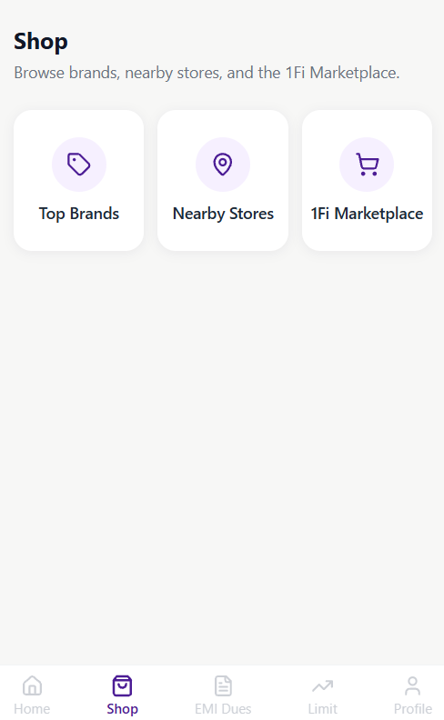
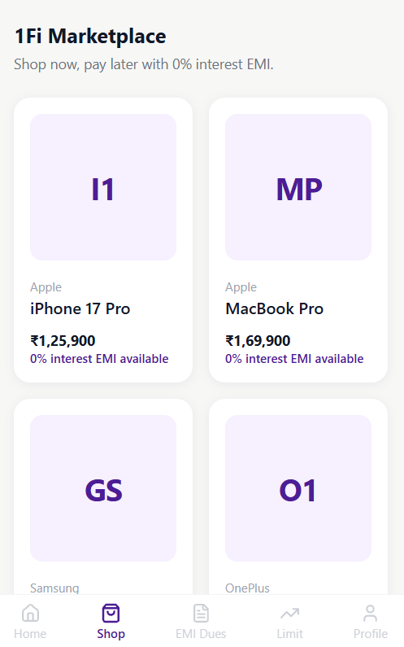
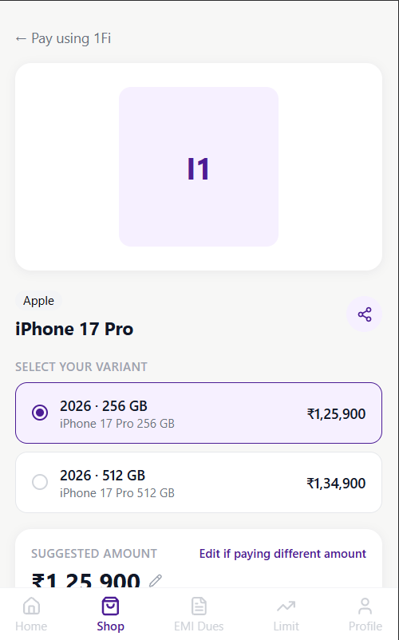
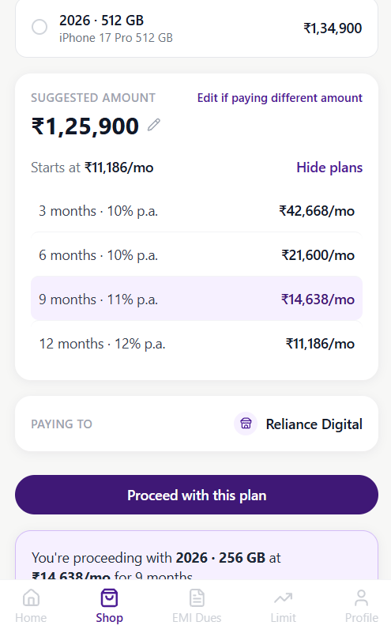
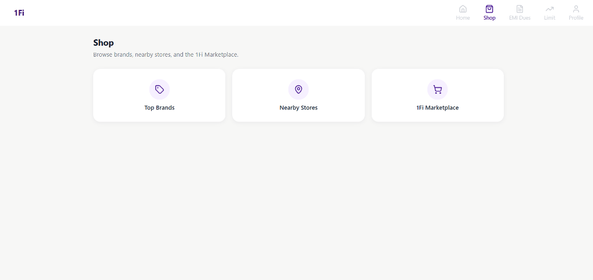
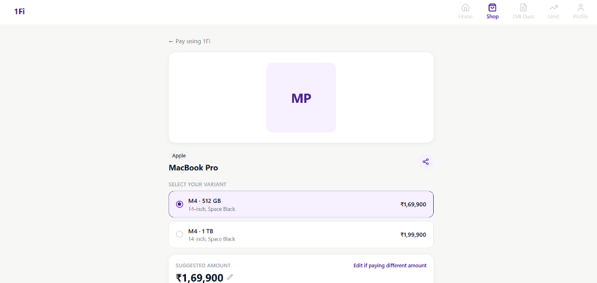
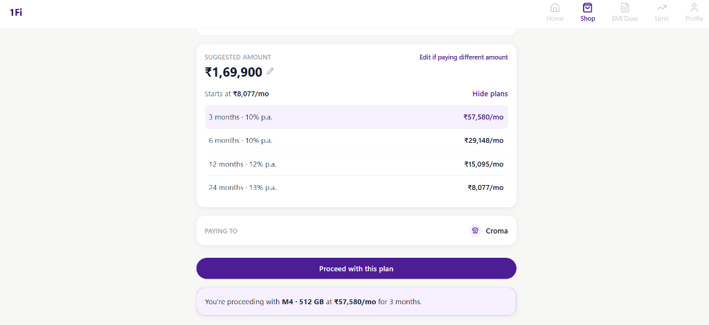

# 1Fi Marketplace — SDE Intern Assignment

## What this is
A "1Fi Marketplace" section built into a Shop page, per the assignment brief.
Users can browse a product catalog, select a variant, choose a 0%-interest
EMI plan, optionally edit the amount they want to pay against, and proceed.

## 📸 App Preview

### 📱 Mobile Experience

| 1. Shop Hub | 2. 1Fi Marketplace | 3. Variant Selection | 4. EMI Plan & Summary |
|:---:|:---:|:---:|:---:|
|  |  |  |  |

<details>
<summary><b>🖥️ View Desktop Experience (Click to expand)</b></summary>

<br />

#### 1. Shop Hub


#### 2. Variant Selection


#### 3. EMI Plan Selection & Confirmation


</details>

## Stack
Next.js (App Router) + Tailwind CSS. Chosen because it matches 1Fi's own
production stack (React/Next.js/Node.js, per their public job listing),
not just for speed of development.

## Scope
Strictly what the assignment document and email specify:
- Shop page with three entries: Top Brands, Nearby Stores, 1Fi Marketplace
- Top Brands / Nearby Stores are intentionally blank placeholders (explicitly
  permitted by the brief)
- 1Fi Marketplace is fully built: product listing → product detail → variant
  selection → EMI plan selection (with editable amount) → proceed CTA
- No login/eligibility-check flow, no mutual-fund-pledge screens, no real
  payment/checkout — those are real 1Fi features outside this assignment's
  scope

## Assumptions (documented, not hidden)
- **Shop page layout**: I was not able to see the actual Shop page in the app
  (only Home, EMI Dues, Limit, and the EMI-selection screen were available as
  screenshots). The three-option layout is inferred from the "Quick Actions"
  icon-row pattern used elsewhere in the app (see Limit screen).
- **EMI rates**: the 3-month and 6-month rates (10% p.a.) and resulting
  monthly amounts for iPhone 17 Pro are taken directly from a real app
  screenshot, and the EMI formula was verified against those real numbers.
  Rates for other tenures (9/12/24 months) and for all non-iPhone products
  are reasonable placeholders, not confirmed real data.
- **Product prices**: iPhone 17 Pro prices are real (from screenshot). All
  other product prices (MacBook Pro, Galaxy S25 Ultra, OnePlus 15) are
  plausible placeholder prices — no real source was available in the time
  given.
- **Product images**: no real product images were available, so a simple
  initials-based placeholder component is used instead of hotlinking or
  fabricating product photography.
- **Merchant/"Paying to" info**: not visible in full in any available screenshot, so 
  partner-brand names shown (Reliance Digital, Croma, Vijay Sales, OnePlus Store) 
  are drawn from the real "Our Brand Partners" list on the Home screen, not 
  confirmed per-product merchant data.

## Design tokens
Colors, card style, button style, and the EMI-selection UI (radio-style
variant rows, EMI list, "Starts at ₹X/mo" pattern) are taken directly from
real 1Fi app screenshots, not invented.

## Running it
```
npm install
npm run dev
```
Open `http://localhost:3000` — redirects to `/shop`.

## Running tests
```
npm test
```
Runs unit tests for the EMI calculator (`lib/emiCalculator.test.js`),
including a check against the real screenshot figures.

## Architecture notes
- Mock data lives in `lib/mockData.js`; the UI never imports it directly —
  it always goes through `/api/marketplace/products` and
  `/api/marketplace/products/[productId]`, so swapping in a real backend
  later means only changing the API route implementations.
- EMI math is a pure, tested function (`lib/emiCalculator.js`), decoupled
  from the UI, and recomputed client-side when the user edits the amount.
- Loading and error states are handled explicitly for both the listing and
  detail pages (not just happy-path).
